# Path Planning for two Dubins vehicles in evacuation setting

## Contributors

The two contributors are:
1. Nguyen Viet Tung - [Github page](https://github.com/VTNguyen490)
2. Nguyen Viet Bach - [Github page](https://github.com/bachnguyenviet)

This project is part of the course ***Robots planning and its application*** offered by University of Trento.

## Description
This project aims to develop two approachs (Sampling-based and Combinatory) for finding a collision-free path for two cars moving simultaneously with each other to reach the gate within a given time limit. The two cars are limitted to only perform Dubin maneuvers and must be traveling at one constant velocity at all time. The path of the two cars must not collide with obstacles or the other car.

Generally, for completeness, the only way to precisely report the existence of a path and if it does, get the optimal path is to solve the incredibly complex BVP(Boundary Value Problem) in which there are multiple differential constraints and inequality constraint. Therefore, this project's focuses is not on trying to solve the BVP problems but are on creating roadmap in such way that only the six solutions of the Dubin path have to be applied to find the path, thus avoiding having to solve the BVP problem. These kind of approach typically require more computational power but are generally more simple to implement. However, these approach are not without their drawbacks; the main drawback are the two approaches in this project mostly work on discrete configuration space (graph) and not the original continuous configuration space. Therefore, the algorithms may be optimal in their configuration space but will not be the most optimal solution possible in the continuous configuration space. Similarly, they might also report no available path where there is.

With that said, this project propose methods for finding the sub-optimal and collision free path to the gate for the two cars.

## Assumption
1. The map borders, the two cars and all the obstacles are each described as its edges and vertices and assumed to be convex,satisfying that no set of three of its vertices being collinear. Additionally, the map borders and obstacles are assumed to be static.

<div style="text-align: center;">  
  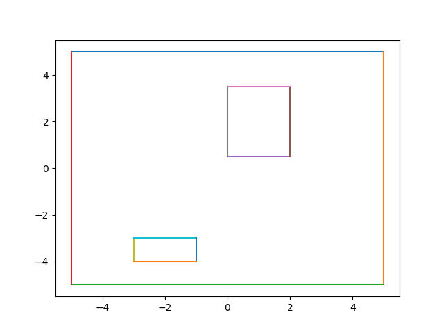  
  <figcaption>Representation of the configuration space</figcaption>
</div>  

2. The two cars are also assumed to be bounded to only travel on the XY plane. Since the two cars are traveling at one constant velocity, the length of the path can be used as the time it take to traverse that path and also can be use to describe the current time. For the implementation of the algorithm, assume a appropriate velocity, the two car turning radius is set to be 0.4.

3. The gate and two cars' initial postions are free (inside the map and not overlapping with obstacles) 

## Methodology

### Sampling-based approach

- **Creating Roadmap**
   
Since our model has differential constraint (the Dubin maneuvers constraint), we discritize our model and apply Discrete-time model sampling create a roadmap. For each time interval, the car is only allowed to follow one constant control law u.

<div style="text-align: center;">  
  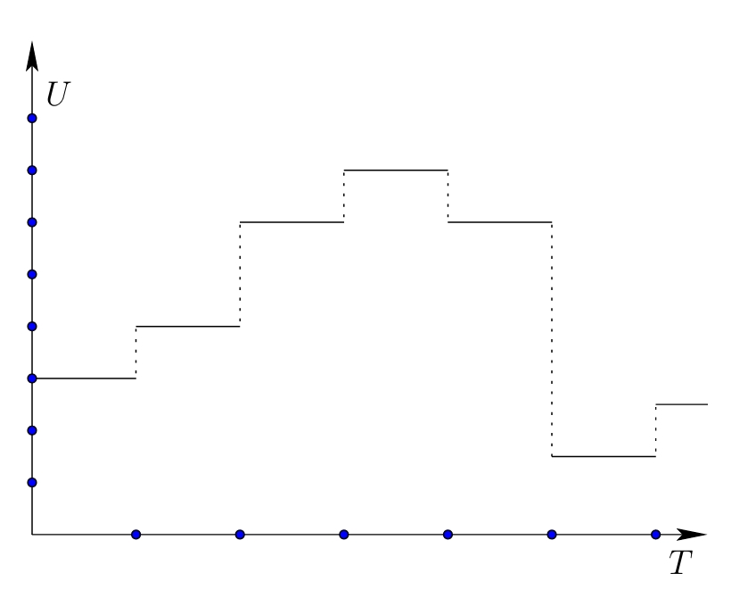  
  <figcaption>Discrete time sampling u</figcaption>
</div>  

The car is restricted to travel at one constant velocity thus our only control action remain is the angular velocity of the car. Typically, this already can create a fairly complicate roadmap depending on the resolution of the angular velocity. Fortunately, since Dubin maneuvers dictates that we must apply none or the maximum or minimum of the angular velocity allow, Our list of applicable control action narrowed down to the three resolutions: (minimum, 0, maximum) or (-maximum, 0, maximum). Depending on the velocity, we can choose the time interval such that the three possible resolutions of agular velocity (minimum, 0, maximum) would result in one of these three results:

1. Turning to the left $90^o$
2. Turning to the right $90^o$
3. Go straight an equivalent length to the two above actions  

For simplicity sake, we directly sample the three above actions iteratively which will create a reachability tree for the car.

<div style="text-align: center;">  
  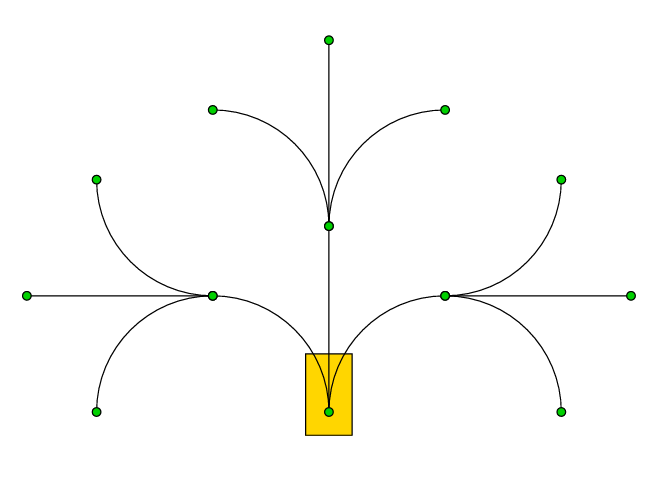  
  <figcaption>Two step reachability graph</figcaption>
</div>  

This reachability tree acts as the roadmap. Once the car has reached the roadmap, the algorithm only have to perform graph search in order to find a collision free path for the car.

- **Backward roadmap generating for Dubin path**

For Dubin path, if we start as an initial node and perform an maneuver straight, to the left or right to reach the goal node. Then it is also true that if we reverse the car from the goal node the exact direction and length we will arrive at the initial node and vice versa.

Therefore, we can use this to generate our roadmap backward from the gate. This ensures that the 2 car can work on the same roadmap and the two car don't have to leave the roadmap to reach the goal. This method of roadmap generation also simplify the graph searching process. Since the roadmap is unidirectional and each node has exactly one child node (i.e a car at that node has only one way to move), once the car reach its first node on the roadmap, there is an only path to travel from that node to the gate.

<div style="text-align: center;">  
  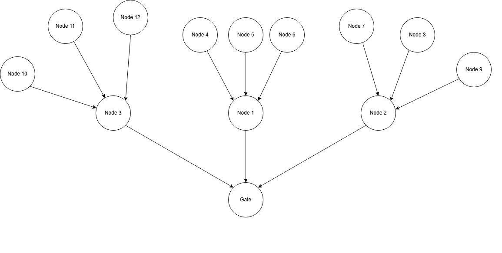  
  <figcaption>Graph representation</figcaption>
</div>  


Each time the algorithm sample a new node, the path from its parent node to the node is then check for collision with obstacles and map borders and only added to the roadmap if the path is collision free (with obstacles and map borders). Additionally, since the number of node for the rwachability graph can increase exponentially, the map is further divide into rectangle cells and each cell is allowed to contain only one node.

- **Collision checking**

The path is first sample into small interval of the same length. Then the algorithm will check collision with each sampled pose of the car on the path using the two phase collision checking approach.

1. **Broad phase** : First, each car is approximated to a circle and the algorithm check the collision of the (or the other car) with the circle. If this check fail (i.e the circle collide with the obstacle) then the more time cosuming narrow pahse with be employed.
2. **Narrow phase** : This phase will check the collision between each pair of car edge and obstacle edge.

Not only collision checking with the obstacle, but collision checking between two cars also apply this method. Since every interval is equal, the collision checking function will check for the pose of two car at the same time stamp.

<div style="text-align: center;">  
  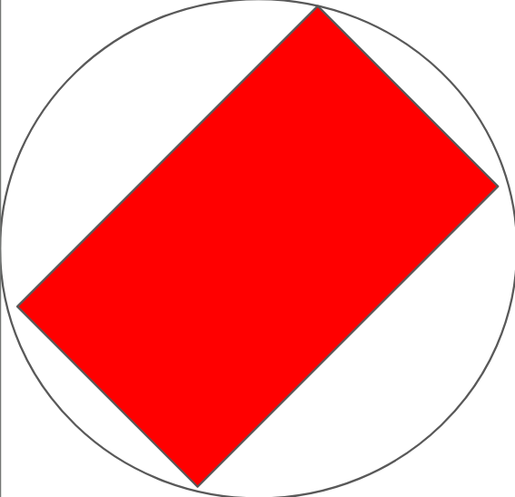  
  <figcaption>Broad phase collision boundary for car</figcaption>
</div> 

- **Searching for path in the roadmap**
  
After finisehed creating the roadmap, ideally, we apply the six solution of Dubin paths to go from a car's initial position to each node in the roadmap to generate the set of all paths from its initial position to the gate for each car. Then, each pair of paths is checked for collision between the two cars as well as minimum value. However, this require to much computational power; therefore, in this project, we will only search for 5 closest nodes of each car.

- **Preliminary experiment result**

Result from preliminary testing, the algorithm was able to find a collision free path for both car.

<div style="text-align: center;">  
  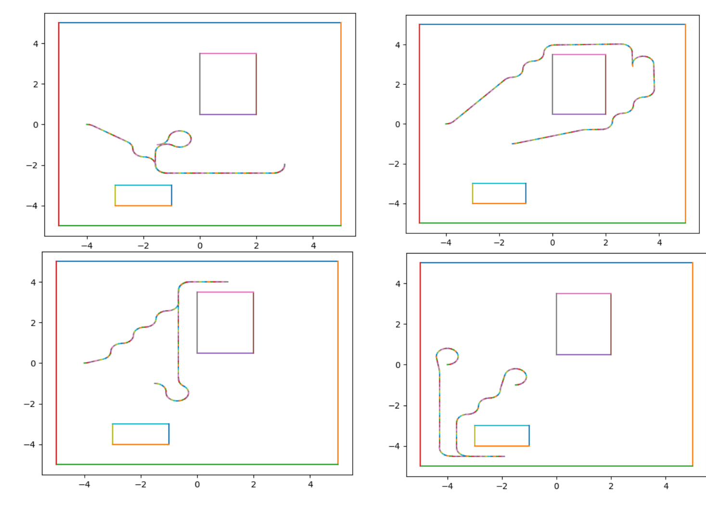  
  <figcaption>Experiment result</figcaption>
</div> 

### Combinatory approach

Because it is difficult to apply simultaneous planning for the two car when dealing with differential constraint, and constant velocity constraint, this part will apply priority planning to plan the path for one car first and the second car will bases on that path to avoid collision with the first car. This approach may fail to find path where it exists but the approach is suitable considering the context of evacuating and the map isn't very complex.

- **Finding path for the first car**

1. **Creating  $C_{free}$  for the first car:** Since we are applying priority planning, we first create the free configuration space for the first car without considering the existence of the second car. To create the free configuration space , we employ polygon offsetting method for the sake of simplicity. If the car is outside of the free configuation space created by polygon offsetting , it is not guarantee for the car to collide with the obstacles or the map border. However, it is guarantee the car to be collision free if is stay inside the free configuration space.

<div style="text-align: center;">  
  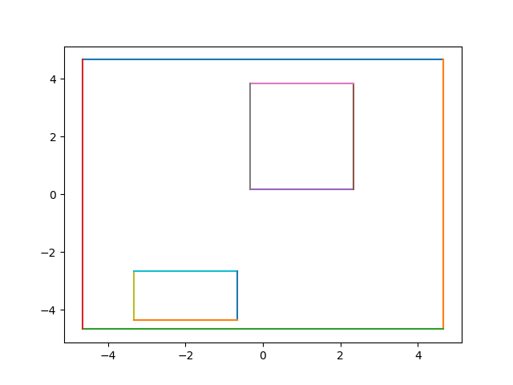  
  <figcaption>Polygon offseted version of the map used in sampling-based approach</figcaption>
</div> 

2. **Creating roadmap for the first car:** For the first car, because we want to only have to apply the six solutions from Dubin paths, our approach is for the first car to interpolate along the voronoi roadmap. Since edges belonging to the voronoi roadmap are the furthest away from obstacles and map borders, we are getting the "best chance" to interpolate through the path without colliding with an obstacle. First we will use the Voronoi Boost library for C++ implementation and the pyvoronoi library for python implementation to create voronoi diagram. We can obtain the voronoi roadmap after only taking primary cells and the edges of these cells who are not coincide with any of the input edge.

<div style="text-align: center;">  
  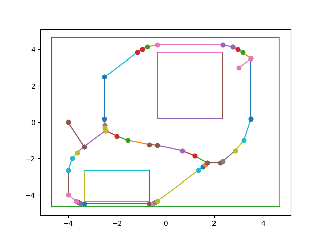  
  <figcaption>voronoi roadmap of the above offsetted map</figcaption>
</div> 

3. **Finding path for first car:** First, we connect the start and goal node with their correspond nearest, unobstructed node to include them into the roadmap. Next, we use Dijkstra to find the path from the start to goal node. Once the path (in term of node the car need to follow) is obtained, we employ interpolation and setting all length of dubin path that collide with obstacle or map border to inf.

*Python code example for checking and setting the length of path to inf*
```py
sample_pose = sample_path(dubin_path, initial_pose,resolution,limo_turning_rad)
collision = False
for pose in sample_pose:
    for obstacle in offset_obstacles:
        if point_in_polygon(pose,obstacle):
            collision = True
            break
    
    if collision:
        length += inf
        break
    else:
        if not point_in_polygon(pose,offset_map):
            length += inf
            break
```
With this, we are guarantee to get the collision free path if it exist. However, this path collision checking is very costly since it has to check for every sample on the path. In order to reduce the amount of computations require, we make some simple observations:

<div style="text-align: center;">  
  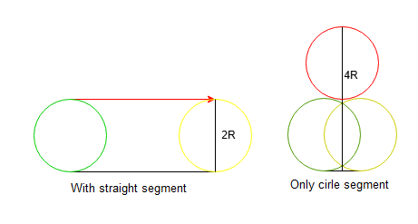  
  <figcaption>On the left, with straight segment. On the right, with only circle segment</figcaption>
</div>

Because the six solutions of Dubin path only contain three segments and always start and end with cirle. Therefore, we can make a simple observation that if the dubin path contains a straight segment, the distance between the car and the edge connecting start and end point can never be larger than twice the turning radius. And if the dubin path only contains circle segment then the distance between the car and the edge connecting start and end point can never be larger than four times the turning radius. Therefore, if we know that the distance of and edge to the nearest obstacle is large enough, we can skip the collision check.

```py
if contain_straight_segment(dubin_path):
    mul = 2
else:
    mul = 4
if dis < mul*limo_turning_rad:
    sample_pose = sample_path(dubin_path, initial_pose,resolution,limo_turning_rad)
    collision = False
    for pose in sample_pose:
        for obstacle in offset_obstacles:
            if point_in_polygon(pose,obstacle):
                collision = True
                break
        
        if collision:
            length += inf
            break
        else:
            if not point_in_polygon(pose,offset_map):
                length += inf
                break
```

Resulted path after interpolation:

<div style="text-align: center;">  
  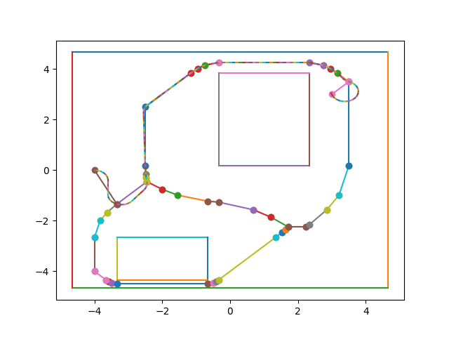  
  <figcaption>Path for the first car after interpolation</figcaption>
</div> 


- **Finding path for the second car**

Finding part for the first car is not as simple as the first car because the first car has added another dimension to the configuration space of the second car. Not only that, since the second also has constraint on its velocity, it is very difficult to know which vertices inside the 3D $C_{free}$ can be connected. 

E.g: (x1,y1,t1) and (x2,y2,t2) can never be connected because the path from (x1,y1) to (x2,y2) may take longer or shorter than $t_2-t_1$  considering the car is moving at constant velocity.

For the planning of the second car, we take an approach somewhat similar to the approach of searching on latice. First, we perform polygon offsetting for the map and then rotational transformation for the whole map including the initial pose of the two cars and the gate such that the orientation of the gates is always $90^o$. Then, we perform approximate cell decomposition based on the gate's pose such that the gate always lies on the position depicted below:

<div style="text-align: center;">  
  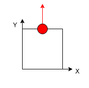  
  <figcaption>The gate (whose orientation should always be 90) lies on the midpoint of a horizontal edge of a cell</figcaption>
</div> 

Each cell is also devided into four subcells, each sub-cell will be either empty or not. These four sub-cells will correspond to which action is applicable in the specific circumstance. 

<div style="text-align: center;">  
  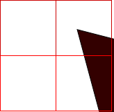  
  <figcaption>The gate (whose orientation should always be 90) lies on the midpoint of a horizontal edge of a cell</figcaption>
</div> 


Now we have the list of allowed sequences of action:

<div style="text-align: center;">  
  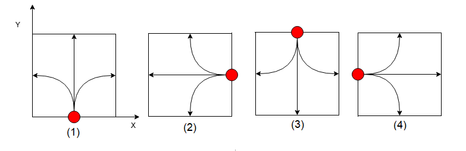  
  <figcaption> Allowed list of action</figcaption>
</div> 


The idea is that if we start on one of the above depicted point, through the list of allowed sequences of action, the car will always remain on the mid point of an edge of some cells with correspond orientation (similar to the above depiction), thus creating the latice for the whole map. Additionally, based on the sub-cells of its current cell, the car will know which action is applicable and which action is not.

Based on this latice, we can create some kind of interconnecting graph. Each node in our graph has four representative value $(x,y,\theta, time)$ where the value time represent the time it take to travel from a start node to that node and can have infinite resolution. For this reason, theoritically, we have an infinite amount of nodes.

At a node, in order to know which "node" it is connected to, we have to calculate that next node pose and time based on the cuurent node's time value and pose. Not only that, but the action must be in an empty sub-cell (E.g: In the figure above, in situation 1, the maneuver to the right is not allowed if the bottom right sub-cell is not empty) and base on the current node's time, forward sampling to check that the action must also not collide with the first car. 

A* pseudo-code python Implementation for adding node to open list
```py
for action in actions_list:
  x,y,theta = current_node.x, current_node.y, current_node.theta
  if action_is_allow([x,y,theta],action): 
    current_pose = [x,y,theta]
    next_pose = get_next_pose(current_pose,action)
    length = get_length_action(action)
    new_node = Node(next_pose,node.time + length)
    if not new_node in closed_list:
      if not new_node in open_list:
          current_limo0  = get_pose_at_time(limo0_initial_pose,limo0_path,current_node.time)
          limo0_action = get_action_during_time(limo0_path, current_node.time, next_node.time)                             
          if collision_between_2_limo(current_limo0,limo0_action,current_pose,action):
              continue
          cost = next_node.time + euclidean_distance(next_node, end_node)
          path = copy.deepcopy(final_path_list[-1])                        
          path.append(action)
          open_list.append(new_node)
          cost_list.append(cost)
          path_list.append(path)
```
This approach is suitable for A* or Dijkstra algorithm because these algorithm only concerns with nodes that are currently connected, either directly or through other nodes, to the start node. The python code snippet above show the A* implementation for adding new node of the graph to open list. As soon as the current node is on the latice of the end node, the program will stop and return path correspond with that node. When apply this A* algorithm to our second car, however, we have to implement two additional methods to help us prioritize which node to choose among all the node in open list since the number of node can be rather large:

1. **Adding a maximum time allow for each latice:**  During the algorithm operation, if the algorithm encounter a node whose pose and time satisfies the condition that: from that time onward, since we already had the path for the first car and thus its remaining path, there is no path possible for the second car to collide with the first car; then that will be the latice's maximum time allow and the algorithm will not add any node who is on the same latice but with a higher time.

2. **Adding reference path** Before, running the expensive A* algorithm, we will run Dijkstra on a more simple version of the graph where every node only has (x,y,orientation). We run this first to check that, without considering the first car, the path for the second car exist first. After finding that path ,check if it collides with the first car and if it does the algorithm will use this path as reference for the A* algorithm to prioritize the node on the path otherwise it will use that path directly.

Pseudo-code python code implementation of the above algorithm:
```py
while open_list:
  res = np.where(cost_list == np.min(cost_list))[0]
  node = open_list.pop(res[0])
  cost = cost_list.pop(res[0])
  path = path_list.pop(res[0])
  closed_list.append(node)
  final_cost_list.append(cost)
  final_path_list.append(path)
  if (round(node.x,4) == round(end_pose[0],4)) and (round(node.y,4) == round(end_pose[1],4)) and (round(node.theta,4) == round(end_pose[2],4)):
    return True, path

for action in actions_list:
  x,y,theta = current_node.x, current_node.y, current_node.theta
  if action_is_allow([x,y,theta],action): 
    current_pose = [x,y,theta]
    next_pose = get_next_pose(current_pose,action)
    length = get_length_action(action)
    new_node = Node(next_pose,node.time + length)
    if not new_node in closed_list:
      if not new_node in open_list:
          if ( next_pose in visited_latice):
            index = visited_latice.index(next_pose)
            if cannot_collide[index] and new_node.time > max_allow_time[index]:
              continue

          current_limo0  = get_pose_at_time(limo0_initial_pose,limo0_path,current_node.time)
          limo0_action = get_action_during_time(limo0_path, current_node.time, next_node.time)                             
          if collision_between_2_limo(current_limo0,limo0_action,current_pose,action):
            continue
          if next_pose in reference_path:
            mul = 0.25
          else:
            mul = 1
          cost = (next_node.time + euclidean_distance(next_node, end_node))*mul
          path = copy.deepcopy(final_path_list[-1])                        
          path.append(action)
          open_list.append(new_node)
          cost_list.append(cost)
          path_list.append(path)
          update_visited_list(new_node)
```
With the two above modification for the A* algorithm, the path for the second car will be sub-optimal. In order to find the optimal solution for this type of graph, base Dijkstra must be applied but it will be too computationally expensive. With that said, we applied the alogrithm for some preliminary testings and obtain the following results:

<div style="text-align: center;">  
  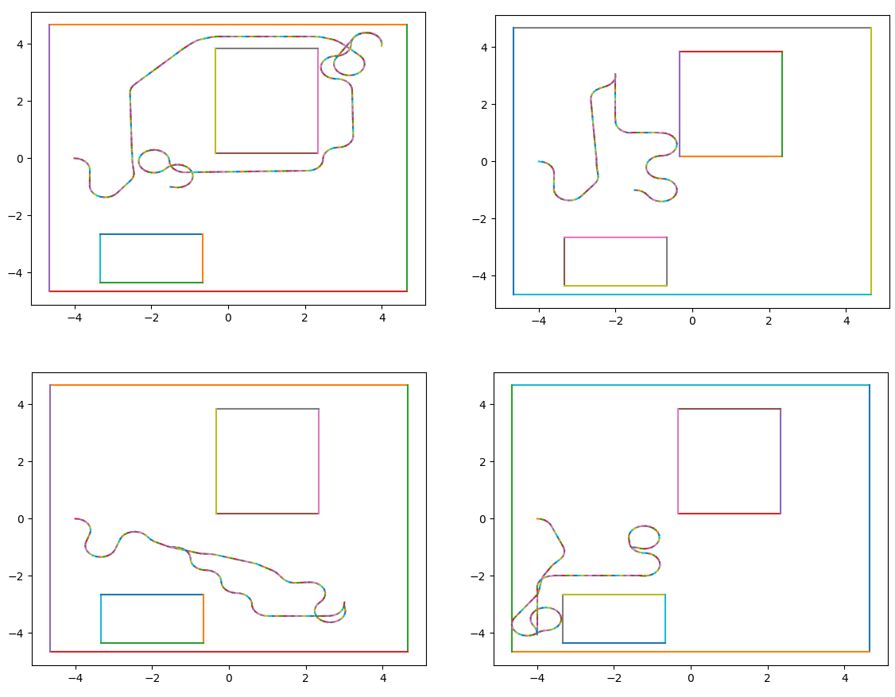  
  <figcaption> Result for combinatory planning</figcaption>
</div> 

### Testing for simulation in gazebo

1. **Simulation set up**

- Please refer to https://github.com/idra-lab/loco_nav for the simulation set up. 

2. **How to run the project**
- Open a terminal an run the alias
```
lab_planning
```
- In the now docker terminal, run the command to launch the simulation
```
roslaunch loco_planning multiple_robots.launch
```
- Open another terminal and create a new ros package with all the dependencies
```
cd ~/trento_lab_home/ros_ws/src
ros_create_pkg <package_name> rospy std_msgs geometry_msgs obstacles_msgs nav_msgs
```
- Copy all the files on github into the src directory of the new package

- Give the two files execution permission
```
chmod +x ros_com_ubuntu.py
chmod +x ros_sample_ubuntu.py
```
- Open another docker terminal by running
```
dock-other 
```
- Install the pyvoronoi library in the docker terminal
```
pip install pyvoronoi
``` 
- Compile the package in the new docker terminal
```
cd ~/trento_lab_home/ros_ws
catkin_make
```
Source the setup file
```
cd ~/trento_lab_home/ros_ws
source devel/setup.bash
```
- For combinatorial planning ,run:
```
rosrun <package_name> ros_com_ubuntu.py
``` 
- For sampling-based planning, run:
```
rosrun <package_name> ros_sample_ubuntu.py
``` 

3. **Result**

<div style="text-align: center;">  
  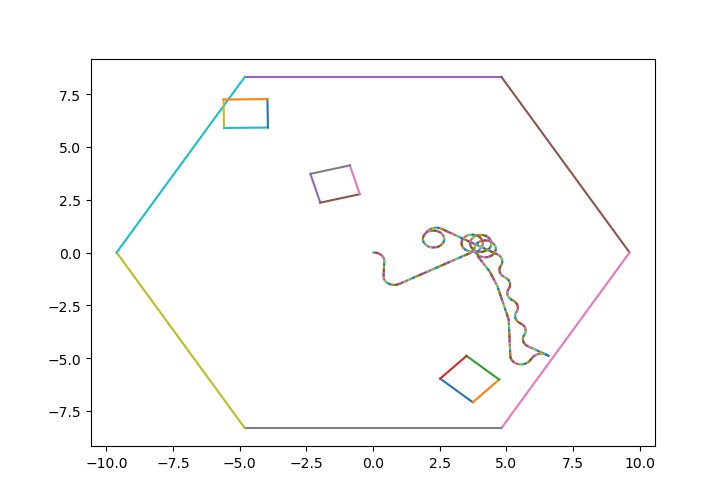  
  <figcaption> Simulation result for combinatory planning</figcaption>
</div> 

For the combinatory planning, the path generated may be convoluted. This is due to the interpolation process where the car has to go through every node in the voronoi roadmap. Two node in the roadmap who are too close to eah other may cause the car to have to cirle around depending on the resolution of interpolation. The runtime of the combinatorial planning can varies a lot since it depends on the costly A* algorithm mentioned above.

<div style="text-align: center;">  
  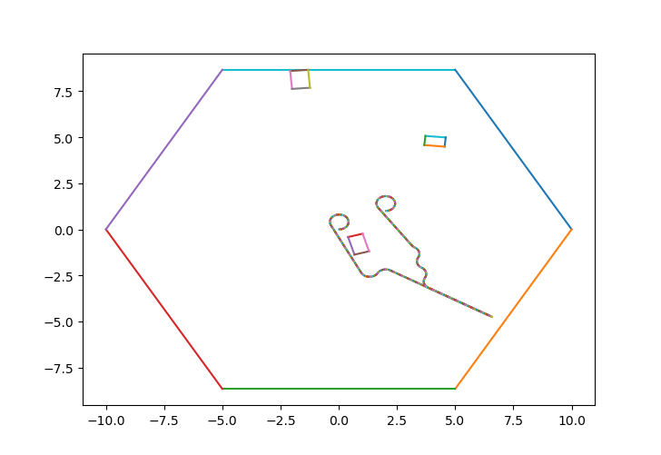  
  <figcaption> Simulation result for Sample-based planning</figcaption>
</div> 

For the sample-based planning, the path is generally more "straight forward" but the runtime of the sample-based planning may vary drastically depending on the size of the map. The larger the map, the more samples there are and generally the path is longer which make the collision checking algorithm take longer to execute.

The implemetation of the above algorithm is done in python. Whether or not the two limos collide with each other also depends on the path tracking control system, which we only applied the provided one in this project, so we cannot know or control how close the two limo follow their given paths. Therefore, each algorithm (combinatory and sample-based), should be run several times to test.  

### Conclusion

While the two approaches are not without some drawbacks, nevertheless, they have provide more options, whose performance may vary depend on the given map and minimum turning radius, for the problem of finding path for two dubins vehicle. 


